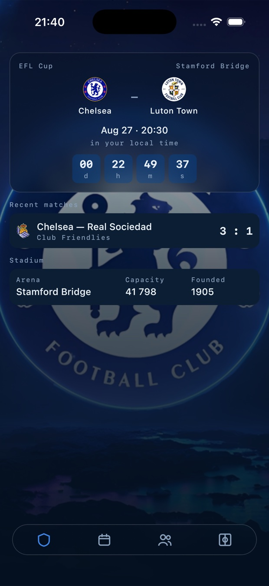
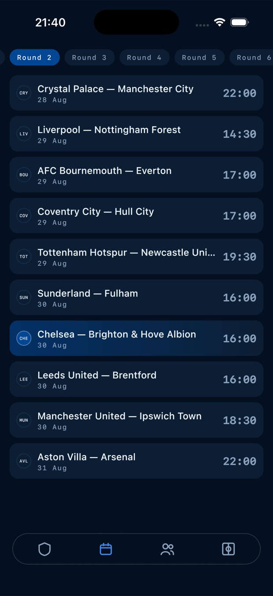
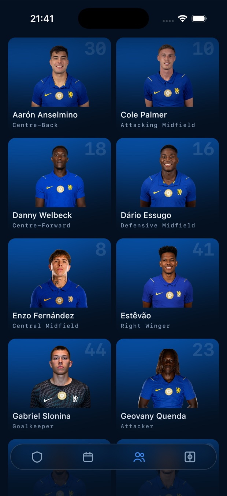
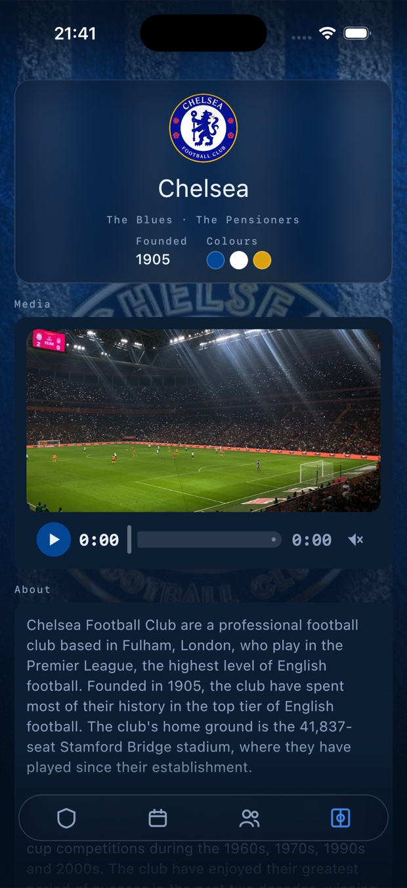
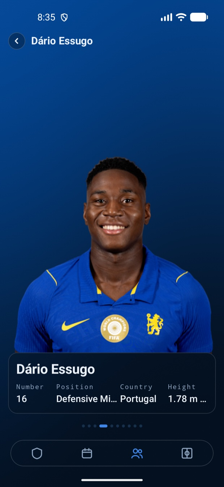
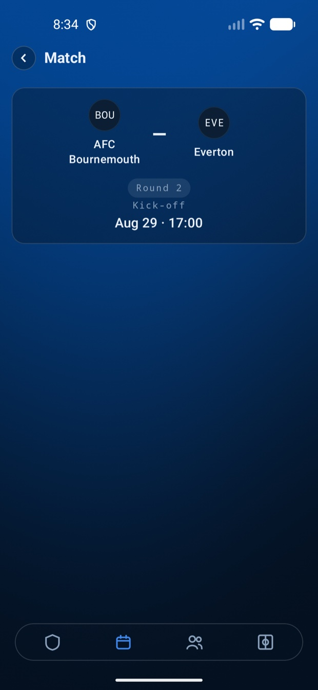
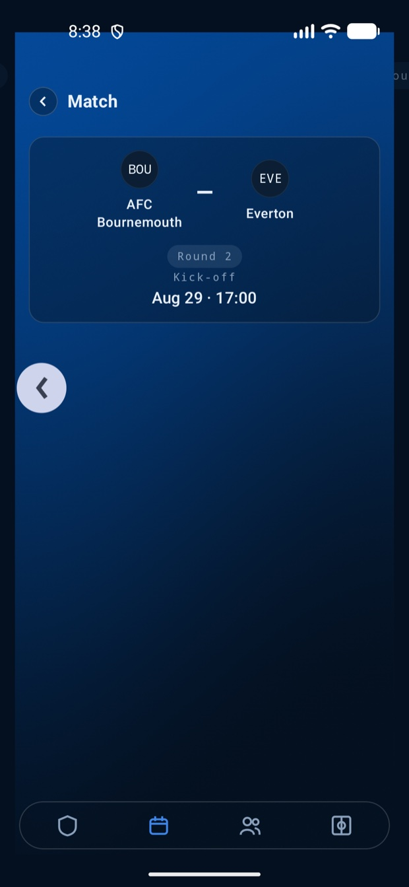

# Bridge

**A worked example of a Kotlin Multiplatform app.** One codebase, two platforms, and a real
feature set rather than a template: networking, a database, navigation with its own gesture,
runtime shaders, a video player, background work and tests that run on both platforms.

It is a football supporter app because an example needs a subject. Clone it and run it — there is
no API key to obtain and no account to create.

> Unofficial fan project. Not affiliated with, endorsed by, or connected to Chelsea Football Club.
> No club artwork is stored in this repository; every image is loaded at runtime from the data
> sources listed below.

### iOS

| Matchday | Season |
|---|---|
|  |  |

| Squad | Club |
|---|---|
|  |  |

### Android — the same shared code

| Player | Match | Swipe back, mid-gesture |
|---|---|---|
|  |  |  |

## What is shared, and what is not

Every screen, every state holder, every repository and every test below is written once in
`commonMain`. The platform code is the short list on the right, and it is short on purpose: an
`expect`/`actual` pair is used where the platforms genuinely differ, not to organise the code.

| Concern | Shared | Platform-specific |
|---|---|---|
| UI | Compose Multiplatform 1.11.1 — all screens | — |
| Navigation | Navigation3, routes, router, per-tab stacks, swipe-to-dismiss | — |
| State | `tessera`: `feature()` / `UiStateDelegate`, ViewModels | — |
| DI | Koin 4.2 | Android `Context` binding |
| Network | Ktor 3.5, kotlinx.serialization | OkHttp / Darwin engines |
| Database | Room 2.8 KMP, bundled SQLite | database file location |
| Images | coil3 | — |
| Blur | Haze 2.0 | — |
| Runtime shaders | one source in a dialect both accept | AGSL / SkSL runtime |
| Video | playback contract, transport controls | ExoPlayer / AVPlayer |
| Logging | levels, tags, the debug gate | `Log` / `NSLog` |
| Background refresh | what to refresh | WorkManager / `BGTaskScheduler` |
| Tests | unit tests and a Compose UI test in `commonTest` | run natively on iOS, on a device on Android |

Kotlin 2.4.10, Gradle 9.1, AGP 9.0, JDK 21, minSdk 26. Static analysis is detekt with a rule
written for this repository; performance has a Macrobenchmark module and a recorded baseline
profile.

## What is interesting here

**One shader source, two runtimes.** Two runtime shaders drive the app's surfaces: a club-blue
wash behind the squad cards and the player pager, and sweeping floodlights on the club screen —
three cones aiming on independent sine phases with per-pixel grain, which is there precisely
because a `Brush` cannot express it. Both are written once in the dialect AGSL and SkSL share and
run unmodified on Android and iOS; no dialect difference was needed.

```glsl
uniform float uTime;
uniform float2 uResolution;

half4 main(float2 fragCoord) {
    float2 uv = fragCoord / uResolution;
    float light = beam(uv, 0.18, 0.0, 0.55) + beam(uv, 0.50, 2.1, 0.42) + beam(uv, 0.82, 4.2, 0.63);
    ...
}
```

Three things this costs if you get them wrong, each of which failed silently here first:

- **`ShaderBrush` caches.** It calls `createShader` once and rebuilds only when the draw size
  changes, so an animated shader handed out as a `Brush` renders its first frame forever. The
  program and its clock are a handle, and `Modifier.shaded` draws them.
- **Where the clock is read decides what recomposes.** Read in composition, a per-frame value puts
  a snapshot read in the caller's restart scope and recomposes the whole screen sixty times a
  second. It is read inside the draw lambda, so a frame invalidates drawing alone.
- **Compilation is the expensive half.** One program per spec, not per list item: the squad grid
  shares a single compiled program across every card. Compiling inside the frame cost 9 ms of the
  budget, measured with `gfxinfo`.

The club screen frosts a live shader — the light travels *under* the glass, which only works
because the shader is the layer directly beneath the panels. Where no runtime shader exists the
same call returns a still gradient, so callers never branch.

**Glass that cannot be wired wrong.** A `hazeEffect` nested inside its own `hazeSource` is a silent
no-op on iOS — no error, no log. `GlassBackdrop` makes the two siblings by construction and
`Modifier.glass()` exists only inside its scope, so the mistake is unrepresentable rather than
merely documented.

**Strings are never read on the frame.** A Compose resource is a `suspend` call, so reading one
while composing means either blocking the frame or rendering a screen that has no words yet. Each
feature instead declares the ids it needs and asks a `StringResolver` for them once, off the main
thread, before its first frame; the resolved labels then live in the state next to everything else
the screen draws. The host never names a feature — it asks the graph for every `LabelsLoader` and
runs them — so a new feature brings its own strings with it.

**A composition API that refuses to starve.** `combine` emits nothing until every source has
spoken, so one silent source leaves a screen blank forever. `composeState` therefore accepts only
`StateFlow`, which always holds a value; a cold flow must be seeded through `withInitial`, making
"what does this show before the source answers" an explicit decision.

**A cache with two clocks.** Fresh serves from memory, stale serves from memory and revalidates in
the background, expired makes the caller wait. One mutex is the only serialisation point and
nothing is awaited while it is held. Concurrent callers of a key share one load, and a response
that lands after `invalidate` reaches its caller without being written back.

**Storage sized to how fast the data actually changes.** A finished season is 380 fixtures that
can never change again, so Room fetches it exactly once in the lifetime of an install; the season
in progress refreshes a few times a day, the squad every four hours, the club weekly. The next
match and the last result never touch disk, because a countdown built on a stale kick-off is the
defect rather than the optimisation. Freshness stamps live in the database, not in memory — an
in-memory stamp would be gone after a process death and every cold start would re-fetch.

**The season comes from the calendar, not from a constant.** English seasons run August to May, so
the id is derived from the date and the app will not go stale next August; while a new season is
still unpublished it falls back to the previous one.

**A lint rule that keeps a decision true.** English is the only language today, but every string
lives in `strings.xml` from the first commit. A custom detekt rule reports user-visible text
written straight into a composable — including the `%s — %s` separators, which is the first thing
a translation changes.

## Data sources

| Source | Used for | Access |
|---|---|---|
| [TheSportsDB](https://www.thesportsdb.com/free_sports_api) | club, squad, next and last match | free test key, no registration |
| [openfootball/football.json](https://github.com/openfootball/football.json) | full Premier League season | public JSON on GitHub, no key |

### Honest limits

The free tier truncates silently, with HTTP 200:

- **ten players** instead of a full squad;
- **one** past match instead of a run of them;
- five season fixtures — which is why the calendar comes from openfootball instead, where all 380
  arrive in one 108 KB response and paging between rounds costs no network at all;
- five league-table rows out of twenty, which is why there is no table screen;
- two kit images, both from 2019, which is why there is no kit section.

The app treats all of this as content rather than as error: a short list renders as a list, and
only a genuine failure shows a retry. There is no full badge map on the free tier either, so a
club shows its real crest where the feed supplies one per fixture and a three-letter monogram
everywhere else.

## Layers

`core:domain` holds the models and the repository contracts; `core:data` holds Room, the HTTP
clients and the implementations; `foundation:resource` holds the mechanism both of them use —
`Loadable` and the builders that report a source as loading, content or failure. That mechanism
carries no fact about football, which is why it sits below the domain rather than inside it. Features depend on the domain only, so a DAO in a ViewModel is
not a matter of discipline — it does not compile. Only the composition root depends on `core:data`,
which is also what keeps Room's annotation processor out of every feature's build.

There is no use-case layer, and that is a decision rather than an omission. Between a screen and a
repository in this app there is no rule that needs a home: the interesting logic is a time to live,
a season id and a name reconciliation, and each of those already lives with the data it governs. A
`GetSquadUseCase` forwarding one call to one repository would add a layer that decides nothing. If a
rule appears that two screens must agree on, that is when the layer earns its place.

## Modules

| Module | Contains |
|---|---|
| `foundation:tessera` | state holders: `feature()` and `UiStateDelegate` ([readme](foundation/tessera/README.md)) |
| `foundation:coroutines` | the dispatchers a state holder is given, and `safeLaunch`: a launch whose failure is logged instead of reaching the platform handler |
| `foundation:strings` | `StringResolver`: the only way a feature reads a string resource, and the loader contract the host drives at startup |
| `foundation:resource` | how a value is loaded and reported: `Loadable`, the in-memory cache with soft and hard TTL, and the two builders that turn a source into the three states a screen can be in |
| `foundation:logger:api` / `:impl` | the logging contract, and the platform sink behind it |
| `core:analytics:api` / `:impl` | the `track` entry point; each feature declares its own events |
| `core:background:api` / `:impl` | daily refresh: WorkManager and `BGTaskScheduler` |
| `core:connectivity:api` / `:impl` | `ConnectivityManager` and `NWPathMonitor` behind one state flow |
| `core:features:following:api` / `:impl` | followed players: a state holder with no screen, shared by three feature modules |
| `core:domain` | what the app is about: models and the repository contracts |
| `core:data` | how it is fetched: HTTP clients, DTOs, Room, mappers, the repository implementations |
| `uikit` | theme, glass surfaces, runtime-shader brushes, components |
| `navigation:core` | the routing contract, the router, per-tab stacks ([readme](navigation/core/README.md)) |
| `navigation:swipe` | swipe-to-dismiss, knowing nothing about this app ([readme](navigation/swipe/README.md)) |
| `feature:club:api` / `:impl` | club profile and its ground |
| `feature:matches:api` / `:impl` | matchday, season calendar, match detail |
| `feature:squad:api` / `:impl` | squad grid |
| `feature:player:api` / `:impl` | player pager, and the only screen that writes |
| `detekt-rules` | the custom static-analysis rule |
| `benchmark` | baseline-profile generator and startup / scroll benchmarks |
| `shared` | dependency graph, navigation host, iOS framework |
| `androidApp` / `iosApp` | platform shells |

Feature modules never depend on each other. Each is split in two: `api` holds the destinations it
owns, `impl` holds its screens, state holders and wiring. Only the composition root may depend on
an `impl`, and it does so from one file — the DI graph.

**Features reach each other by naming a destination.** Tapping the stadium card on matchday opens
the club screen: `feature:matches:impl` depends on `feature:club:api` and calls
`appRouter.navigateTo(ClubRoute)`. The club's screen, state holder and module stay invisible from
there, so the two features can be built and changed independently.

**Features contribute their own destinations.** Each `impl` binds a `FeatureNavigationEntry` that
registers its routes, and the host collects them from the graph. There is no `when` in the
composition root naming every screen, and adding a feature means adding a binding rather than
editing the host.

Shared configuration lives in three convention plugins under `build-logic`, so a module's build
file is a plugin id and its dependencies.

## Building

Requires JDK 21 and an Android SDK; Gradle provisions its own toolchain.

```bash
./gradlew :androidApp:assembleDebug                      # Android
./gradlew :shared:linkDebugFrameworkIosSimulatorArm64    # iOS framework
./gradlew detekt                                         # static analysis, every module
./gradlew allTests                                       # unit tests, every module
```

For iOS, open `iosApp/iosApp.xcodeproj` in Xcode and run.

## License

[MIT](LICENSE).
