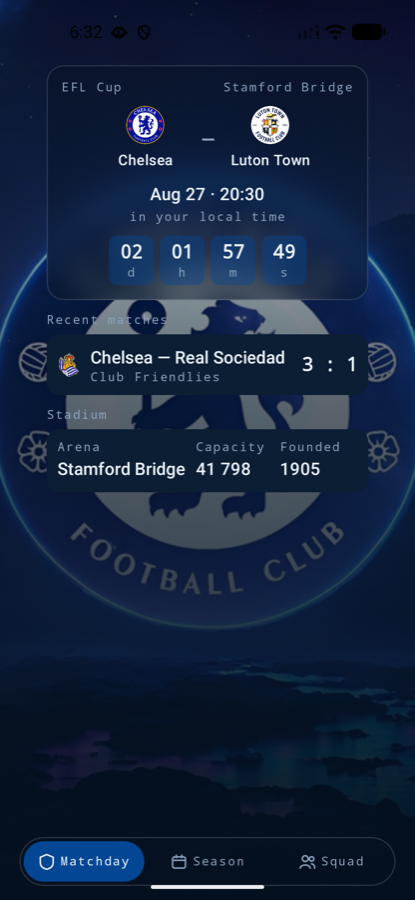
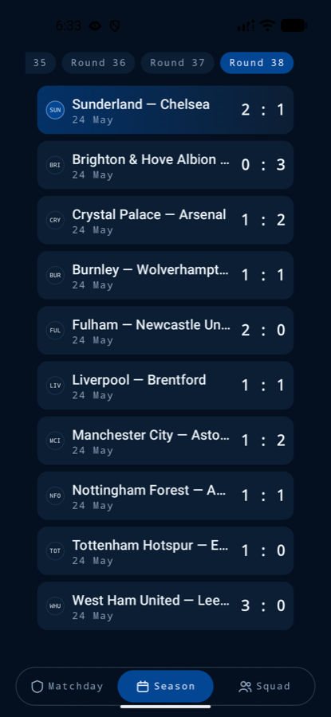
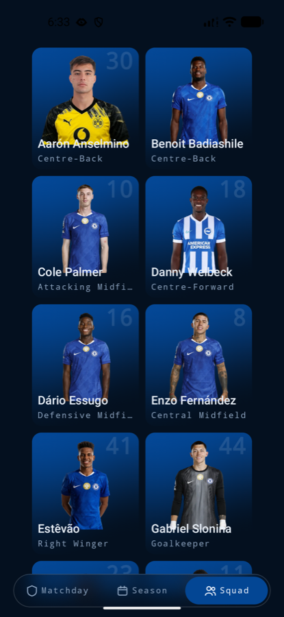
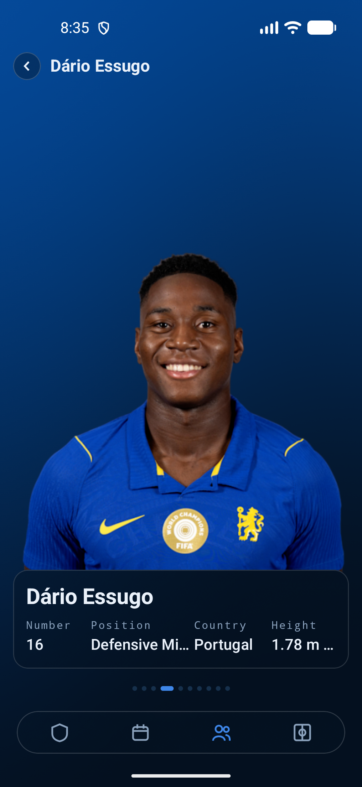
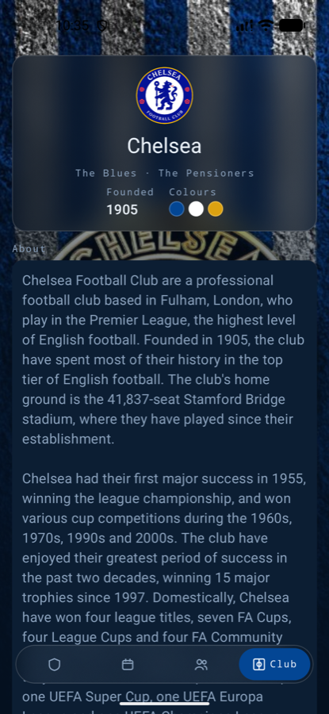
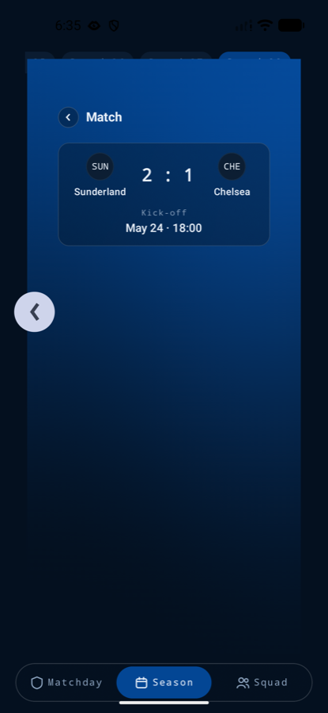
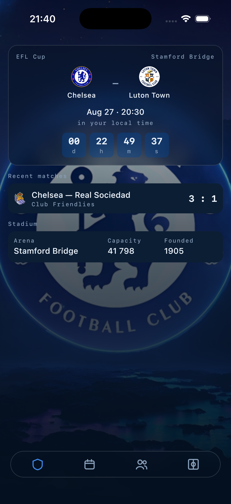

# Bridge

[](https://github.com/Ilinich/Bridge/actions/workflows/ci.yml)

A football supporter app for Android and iOS, built with Kotlin Multiplatform and Compose
Multiplatform. Clone it and run it — there is no API key to obtain and no account to create.

> Unofficial fan project. Not affiliated with, endorsed by, or connected to Chelsea Football Club.
> No club artwork is stored in this repository; every image is loaded at runtime from the data
> sources listed below.

| Matchday | Season | Squad |
|---|---|---|
|  |  |  |

| Player | Club | Swipe back, mid-gesture |
|---|---|---|
|  |  |  |

The same shared code on iOS:



## What is interesting here

**One shader source, two runtimes.** The club-blue background behind the squad and player screens
is a runtime shader written once and executed as AGSL on Android and SkSL on iOS. No dialect
difference was needed. The program is compiled once per spec and only its uniforms change per
frame — compiling inside the frame cost 9 ms of the budget, measured with `gfxinfo`. Where no
runtime shader exists the same call returns a still gradient, so callers never branch.

**Glass that cannot be wired wrong.** A `hazeEffect` nested inside its own `hazeSource` is a silent
no-op on iOS — no error, no log. `GlassBackdrop` makes the two siblings by construction and
`Modifier.glass()` exists only inside its scope, so the mistake is unrepresentable rather than
merely documented.

**A composition API that refuses to starve.** `combine` emits nothing until every source has
spoken, so one silent source leaves a screen blank forever. `composeState` therefore accepts only
`StateFlow`, which always holds a value; a cold flow must be seeded through `withInitial`, making
"what does this show before the source answers" an explicit decision.

**A cache with two clocks.** Fresh serves from memory, stale serves from memory and revalidates in
the background, expired makes the caller wait. One mutex is the only serialisation point and
nothing is awaited while it is held. Concurrent callers of a key share one load, and a response
that lands after `invalidate` reaches its caller without being written back.

**Storage sized to how fast the data actually changes.** A finished season is 380 fixtures that
can never change again, so Room fetches it exactly once in the lifetime of an install; the season
in progress refreshes a few times a day, the squad every four hours, the club weekly. The next
match and the last result never touch disk, because a countdown built on a stale kick-off is the
defect rather than the optimisation. Freshness stamps live in the database, not in memory — an
in-memory stamp would be gone after a process death and every cold start would re-fetch.

**The season comes from the calendar, not from a constant.** English seasons run August to May, so
the id is derived from the date and the app will not go stale next August; while a new season is
still unpublished it falls back to the previous one.

**A lint rule that keeps a decision true.** English is the only language today, but every string
lives in `strings.xml` from the first commit. A custom detekt rule reports user-visible text
written straight into a composable — including the `%s — %s` separators, which is the first thing
a translation changes.

## Data sources

| Source | Used for | Access |
|---|---|---|
| [TheSportsDB](https://www.thesportsdb.com/free_sports_api) | club, squad, next and last match | free test key, no registration |
| [openfootball/football.json](https://github.com/openfootball/football.json) | full Premier League season | public JSON on GitHub, no key |

### Honest limits

The free tier truncates silently, with HTTP 200:

- **ten players** instead of a full squad;
- **one** past match instead of a run of them;
- five season fixtures — which is why the calendar comes from openfootball instead, where all 380
  arrive in one 108 KB response and paging between rounds costs no network at all;
- five league-table rows out of twenty, which is why there is no table screen;
- two kit images, both from 2019, which is why there is no kit section.

The app treats all of this as content rather than as error: a short list renders as a list, and
only a genuine failure shows a retry. There is no full badge map on the free tier either, so a
club shows its real crest where the feed supplies one per fixture and a three-letter monogram
everywhere else.

## Modules

| Module | Contains |
|---|---|
| `foundation:tessera` | state holders: `feature()` and `UiStateDelegate` ([readme](foundation/tessera/README.md)) |
| `foundation:cache` | in-memory cache with soft and hard TTL |
| `core:data` | HTTP clients, DTOs, domain models, repositories |
| `uikit` | theme, glass surfaces, runtime-shader brushes, components |
| `navigation` | the routing contract, per-tab stacks, swipe-to-dismiss ([readme](navigation/README.md)) |
| `feature:club:api` / `:impl` | club profile and its ground |
| `feature:matches:api` / `:impl` | matchday, season calendar, match detail |
| `feature:squad:api` / `:impl` | squad grid, player pager |
| `detekt-rules` | the custom static-analysis rule |
| `shared` | dependency graph, navigation host, iOS framework |
| `androidApp` / `iosApp` | platform shells |

Feature modules never depend on each other. Each is split in two: `api` holds the destinations it
owns, `impl` holds its screens, state holders and wiring. Only the composition root may depend on
an `impl`, and it does so from one file — the DI graph.

**Features contribute their own destinations.** Each `impl` binds a `FeatureNavigationEntry` that
registers its routes, and the host collects them from the graph. There is no `when` in the
composition root naming every screen, and adding a feature means adding a binding rather than
editing the host.

Shared configuration lives in three convention plugins under `build-logic`, so a module's build
file is a plugin id and its dependencies.

## Building

Requires JDK 21 and an Android SDK; Gradle provisions its own toolchain.

```bash
./gradlew :androidApp:assembleDebug                      # Android
./gradlew :shared:linkDebugFrameworkIosSimulatorArm64    # iOS framework
./gradlew detekt                                         # static analysis, every module
./gradlew allTests                                       # unit tests, every module
```

For iOS, open `iosApp/iosApp.xcodeproj` in Xcode and run.

## License

[MIT](LICENSE).
