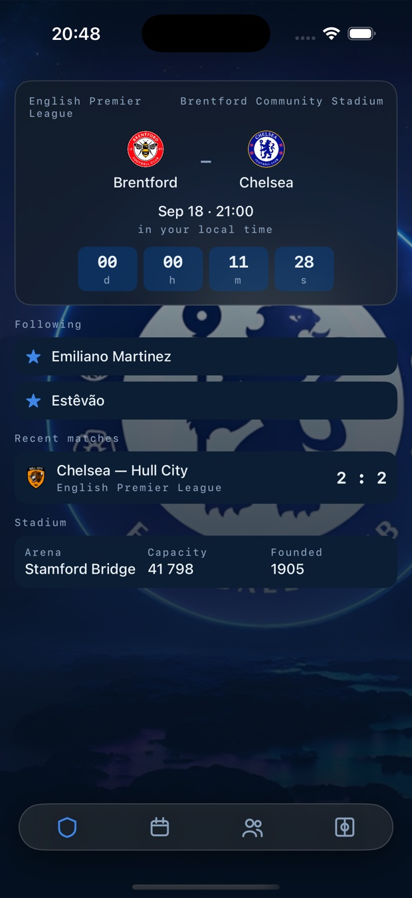
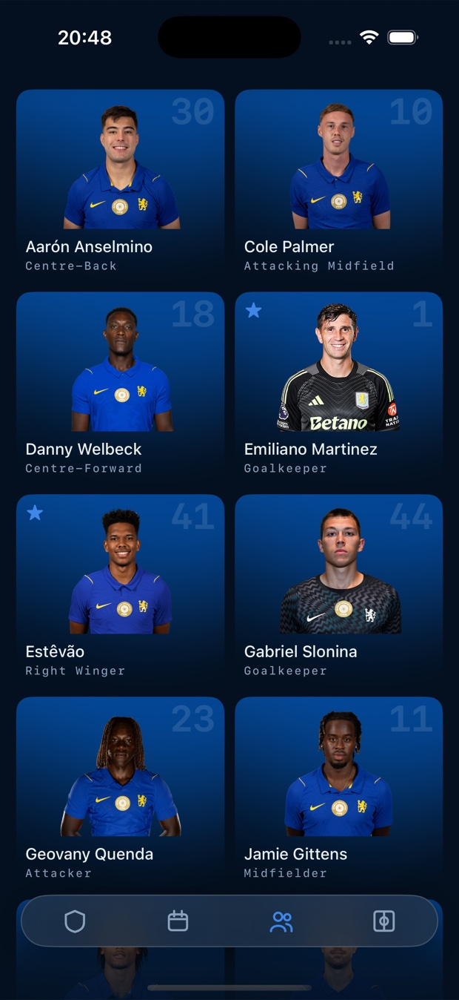
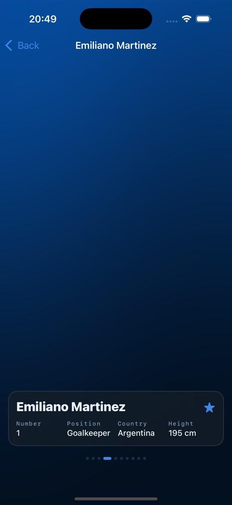
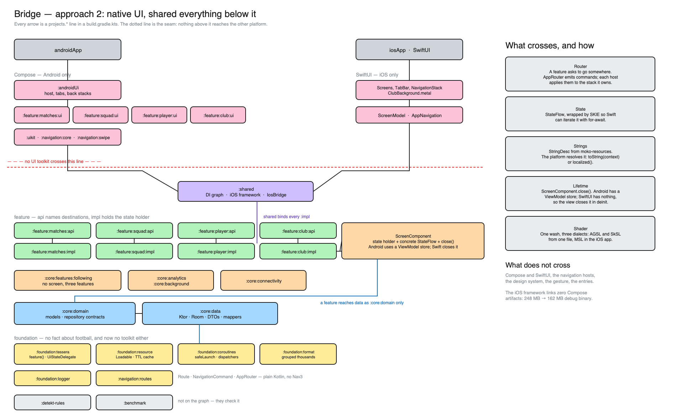

# Bridge

**A worked example of a Kotlin Multiplatform app, built twice.** One feature set — networking, a
database, navigation with its own gesture, runtime shaders, a video player, background work — and
two answers to the question every KMP project has to answer: how much of the UI is shared?

| Branch | UI | Shared |
|---|---|---|
| `master` | Compose Multiplatform, one set of screens | everything, including the screens |
| `feature/native-ui` (this one) | Compose on Android, SwiftUI on iOS | everything below the state holder |

This branch is the second answer. The iOS framework it produces links **zero** Compose artifacts;
the state holders, the navigation decisions, the data layer and the shader maths are still written
once. What each platform owns is the drawing.

It is a football supporter app because an example needs a subject. Clone it and run it — there is
no API key to obtain and no account to create.

> Unofficial fan project. Not affiliated with, endorsed by, or connected to Chelsea Football Club.
> No club artwork is stored in this repository; every image is loaded at runtime from the data
> sources listed below.

### iOS — SwiftUI, on the shared state holders

| Matchday | Squad | Player |
|---|---|---|
|  |  |  |

The same screens on `master`, drawn by Compose Multiplatform:

| Matchday | Squad | Club |
|---|---|---|
|  |  |  |

### Android — the same shared code

| Player | Match | Swipe back, mid-gesture |
|---|---|---|
|  |  |  |

## What is shared, and what is not

The line is drawn under the state holder. Everything that decides — what the screen shows, where a
tap leads, when data is stale — is written once; everything that draws is written twice, on purpose,
because that is where the platforms differ in kind rather than in detail.

| Concern | Shared | Platform-specific |
|---|---|---|
| UI | — | Compose Multiplatform / SwiftUI, screen for screen |
| Navigation | routes, commands, the router that emits them | the back stacks that obey: Navigation3 / NavigationStack |
| State | `tessera`: `feature()` / `UiStateDelegate`, ViewModels, `ScreenComponent` | how a screen holds one: a ViewModel store / `deinit` |
| Strings | the ids and the format arguments, as `StringDesc` | resolving them: `toString(context)` / `localized()` |
| DI | Koin 4.2, one graph | the host's own bindings, passed in at startup |
| Network | Ktor 3.5, kotlinx.serialization | OkHttp / Darwin engines |
| Database | Room 2.8 KMP, bundled SQLite | database file location |
| Images | the urls | coil3 / `AsyncImage` |
| Blur | — | Haze / `.ultraThinMaterial` |
| Shaders | the maths, constant for constant | three dialects: AGSL, SkSL, MSL |
| Video | playback contract, the clip | ExoPlayer / `AVPlayer` |
| Logging | levels, tags, the debug gate | `Log` / `NSLog` |
| Background refresh | what to refresh | WorkManager / `BGTaskScheduler` |
| Tests | unit tests in `commonTest`, plus the iOS mapping tests | run natively on iOS, on a device on Android |

Kotlin 2.4.10, Gradle 9.1, AGP 9.0, JDK 21, minSdk 26. Static analysis is detekt with a rule
written for this repository; performance has a Macrobenchmark module and a recorded baseline
profile.

## What is interesting here

**One shader source, two runtimes.** Two runtime shaders drive the app's surfaces: a club-blue
wash behind the squad cards and the player pager, and sweeping floodlights on the club screen —
three cones aiming on independent sine phases with per-pixel grain, which is there precisely
because a `Brush` cannot express it. Both are written once in the dialect AGSL and SkSL share and
run unmodified on Android and iOS; no dialect difference was needed.

```glsl
uniform float uTime;
uniform float2 uResolution;

half4 main(float2 fragCoord) {
    float2 uv = fragCoord / uResolution;
    float light = beam(uv, 0.18, 0.0, 0.55) + beam(uv, 0.50, 2.1, 0.42) + beam(uv, 0.82, 4.2, 0.63);
    ...
}
```

Three things this costs if you get them wrong, each of which failed silently here first:

- **`ShaderBrush` caches.** It calls `createShader` once and rebuilds only when the draw size
  changes, so an animated shader handed out as a `Brush` renders its first frame forever. The
  program and its clock are a handle, and `Modifier.shaded` draws them.
- **Where the clock is read decides what recomposes.** Read in composition, a per-frame value puts
  a snapshot read in the caller's restart scope and recomposes the whole screen sixty times a
  second. It is read inside the draw lambda, so a frame invalidates drawing alone.
- **Compilation is the expensive half.** One program per spec, not per list item: the squad grid
  shares a single compiled program across every card. Compiling inside the frame cost 9 ms of the
  budget, measured with `gfxinfo`.

The club screen frosts a live shader — the light travels *under* the glass, which only works
because the shader is the layer directly beneath the panels. Where no runtime shader exists the
same call returns a still gradient, so callers never branch.

**Glass that cannot be wired wrong.** A `hazeEffect` nested inside its own `hazeSource` is a silent
no-op on iOS — no error, no log. `GlassBackdrop` makes the two siblings by construction and
`Modifier.glass()` exists only inside its scope, so the mistake is unrepresentable rather than
merely documented.

**A shared string that neither platform has to resolve.** A Compose resource is a `suspend` call —
the words live in a bundle Compose ships — so on `master` a whole machinery grew around that: a
resolver, a loader per feature, and a gate the host waited on before it drew anything. Here a state
holder carries `StringDesc` from moko-resources: a description of a string rather than a string, and
the platform that draws it resolves it with `toString(context)` or `localized()`. Nothing is read
ahead of the first frame because nothing is read at all until something draws.

```kotlin
data class PlayerLabels(
    val title: StringDesc = PlayerStrings.strings.player_title.desc(),
    val number: StringDesc = PlayerStrings.strings.player_number.desc(),
)
```

The cost is one Xcode build phase: a static framework carries no resources of its own, so the
generated bundles are copied into the app — and the crash when they are not is at the first word
drawn, not at build time.

**A state holder with no store to live in.** Android has a `ViewModelStore` and something that
empties it; SwiftUI has neither. `ScreenComponent` is what a Swift view holds instead: the state
holder, its state under a concrete type, and a `close()` the view calls in `deinit`. The DI builds
the wiring once and hands Compose the ViewModel, Swift the component.

```swift
@StateObject private var model = ScreenModel(
    component: IosBridge.shared.matchday(),
    state: { $0.state },
    close: { $0.close() }
)
```

The component is built **inside** the `StateObject` rather than in the view's `init`. A SwiftUI view
is a struct that gets rebuilt constantly; building it there makes one per rebuild, and the ones
SwiftUI discards close on deinit — cancelling the scope the surviving model is waiting on. The
screen then sits at "loading" for ever, which is exactly what it did.

**Navigation that decides in Kotlin and moves in Swift.** The router holds no stack. It repeats
decisions — `navigateTo`, `up` — and each host applies them to the stack it owns: a Compose back
stack on one side, four `NavigationStack`s on the other. The rule that a tab root selects its tab
instead of being pushed is stated twice, once per host, because it is a statement about tabs rather
than about routing. Nothing is replayed: a decision nobody is listening to is dropped, because
obeying it later would move a user who has since gone elsewhere.

Swift gets a vocabulary of its own — `IosNavigation`, a sealed interface SKIE turns into an enum it
can switch on exhaustively. Route classes stay the features' business: a Swift view has no reason to
import four `api` modules, and the export only carries types the exported API mentions.

**One shader, three dialects.** The club-blue wash behind the squad cards and the player pager is
written once in the subset AGSL and SkSL share, and again in Metal for SwiftUI, constant for
constant — the wave across x, the sweep along x+y, and the half-step dither that keeps a gradient
this shallow from banding on an 8-bit ramp. Copied, not re-tuned by eye, which is what makes the two
backgrounds move the same way rather than merely look alike.

**A composition API that refuses to starve.** `combine` emits nothing until every source has
spoken, so one silent source leaves a screen blank forever. `composeState` therefore accepts only
`StateFlow`, which always holds a value; a cold flow must be seeded through `withInitial`, making
"what does this show before the source answers" an explicit decision.

**A cache with two clocks.** Fresh serves from memory, stale serves from memory and revalidates in
the background, expired makes the caller wait. One mutex is the only serialisation point and
nothing is awaited while it is held. Concurrent callers of a key share one load, and a response
that lands after `invalidate` reaches its caller without being written back.

**Storage sized to how fast the data actually changes.** A finished season is 380 fixtures that
can never change again, so Room fetches it exactly once in the lifetime of an install; the season
in progress refreshes a few times a day, the squad every four hours, the club weekly. The next
match and the last result never touch disk, because a countdown built on a stale kick-off is the
defect rather than the optimisation. Freshness stamps live in the database, not in memory — an
in-memory stamp would be gone after a process death and every cold start would re-fetch.

**The season comes from the calendar, not from a constant.** English seasons run August to May, so
the id is derived from the date and the app will not go stale next August; while a new season is
still unpublished it falls back to the previous one.

**A lint rule that keeps a decision true.** English is the only language today, but every string
lives in `strings.xml` from the first commit. A custom detekt rule reports user-visible text
written straight into a composable — including the `%s — %s` separators, which is the first thing
a translation changes.

## Data sources

| Source | Used for | Access |
|---|---|---|
| [TheSportsDB](https://www.thesportsdb.com/free_sports_api) | club, squad, next and last match | free test key, no registration |
| [openfootball/football.json](https://github.com/openfootball/football.json) | full Premier League season | public JSON on GitHub, no key |

### Honest limits

The free tier truncates silently, with HTTP 200:

- **ten players** instead of a full squad;
- **one** past match instead of a run of them;
- five season fixtures — which is why the calendar comes from openfootball instead, where all 380
  arrive in one 108 KB response and paging between rounds costs no network at all;
- five league-table rows out of twenty, which is why there is no table screen;
- two kit images, both from 2019, which is why there is no kit section.

The app treats all of this as content rather than as error: a short list renders as a list, and
only a genuine failure shows a retry. There is no full badge map on the free tier either, so a
club shows its real crest where the feed supplies one per fixture and a three-letter monogram
everywhere else.

## Layers

`core:domain` holds the models and the repository contracts; `core:data` holds Room, the HTTP
clients and the implementations; `foundation:resource` holds the mechanism both of them use —
`Loadable` and the builders that report a source as loading, content or failure. That mechanism
carries no fact about football, which is why it sits below the domain rather than inside it. Features depend on the domain only, so a DAO in a ViewModel is
not a matter of discipline — it does not compile. Only the composition root depends on `core:data`,
which is also what keeps Room's annotation processor out of every feature's build.

There is no use-case layer, and that is a decision rather than an omission. Between a screen and a
repository in this app there is no rule that needs a home: the interesting logic is a time to live,
a season id and a name reconciliation, and each of those already lives with the data it governs. A
`GetSquadUseCase` forwarding one call to one repository would add a layer that decides nothing. If a
rule appears that two screens must agree on, that is when the layer earns its place.

## Modules



Every arrow in that diagram is a `projects.*` line in a `build.gradle.kts` rather than an intention.
The dotted line across it is the seam: nothing above it reaches the other platform, and the right
column says what crosses and in what form. The editable source is
[docs/architecture.excalidraw](docs/architecture.excalidraw).

| Module | Contains |
|---|---|
| `foundation:tessera` | state holders: `feature()` and `UiStateDelegate` ([readme](foundation/tessera/README.md)) |
| `foundation:coroutines` | the dispatchers a state holder is given, and `safeLaunch`: a launch whose failure is logged instead of reaching the platform handler |
| `foundation:format` | figures a state holder formats before a screen sees them, starting with grouped thousands |
| `foundation:resource` | how a value is loaded and reported: `Loadable`, the in-memory cache with soft and hard TTL, and the two builders that turn a source into the three states a screen can be in |
| `foundation:logger:api` / `:impl` | the logging contract, and the platform sink behind it |
| `core:analytics:api` / `:impl` | the `track` entry point; each feature declares its own events |
| `core:background:api` / `:impl` | daily refresh: WorkManager and `BGTaskScheduler` |
| `core:connectivity:api` / `:impl` | `ConnectivityManager` and `NWPathMonitor` behind one state flow |
| `core:features:following:api` / `:impl` | followed players: a state holder with no screen, shared by three feature modules |
| `core:domain` | what the app is about: models and the repository contracts |
| `core:data` | how it is fetched: HTTP clients, DTOs, Room, mappers, the repository implementations |
| `navigation:routes` | the vocabulary both hosts share: `Route`, `NavigationCommand`, `AppRouter`. Plain Kotlin — no navigation library, no toolkit |
| `navigation:core` | the Compose host: `NavDisplay`, per-tab stacks ([readme](navigation/core/README.md)) |
| `navigation:swipe` | swipe-to-dismiss, knowing nothing about this app ([readme](navigation/swipe/README.md)) |
| `uikit` | theme, glass surfaces, runtime-shader brushes, components — Compose, and therefore Android |
| `feature:club:api` / `:impl` / `:ui` | club profile and its ground |
| `feature:matches:api` / `:impl` / `:ui` | matchday, season calendar, match detail |
| `feature:squad:api` / `:impl` / `:ui` | squad grid |
| `feature:player:api` / `:impl` / `:ui` | player pager, and the only screen that writes |
| `detekt-rules` | the custom static-analysis rule |
| `benchmark` | baseline-profile generator and startup / scroll benchmarks |
| `shared` | the dependency graph, the iOS framework, and `IosBridge`: what Swift calls to start and to ask for a component |
| `androidUi` | the Compose host: tabs, back stacks, the bindings a Compose UI needs |
| `androidApp` / `iosApp` | platform shells |

Feature modules never depend on each other. Each is split in three: `api` holds the destinations it
owns, `impl` holds the state holder and its wiring, `ui` holds the Compose screens. The third part
exists because of a compiler rather than a preference — the Compose plugin runs over every
compilation in a project and refuses to work without its runtime, so a module cannot be Compose on
Android and nothing on iOS. Only the composition root may depend on an `impl`, and only the Android
host may depend on a `ui`.

**Features reach each other by naming a destination.** Tapping the stadium card on matchday opens
the club screen: `feature:matches:impl` depends on `feature:club:api` and calls
`appRouter.navigateTo(ClubRoute)`. The club's screen, state holder and module stay invisible from
there, so the two features can be built and changed independently.

**Features contribute their own destinations.** Each `impl` binds a `FeatureNavigationEntry` that
registers its routes, and the host collects them from the graph. There is no `when` in the
composition root naming every screen, and adding a feature means adding a binding rather than
editing the host.

Shared configuration lives in three convention plugins under `build-logic`, so a module's build
file is a plugin id and its dependencies.

## The iOS side, concretely

Swift starts the graph itself and asks it for components:

```swift
@main
struct iOSApp: App {
    init() { IosBridge.shared.start() }
    …
}
```

Three things make that workable, and each is a choice worth knowing about:

- **SKIE** turns `StateFlow` into something Swift iterates with `for await`, and a sealed interface
  into an enum with an exhaustive `switch`. Its analytics upload is switched off — a build of this
  repository should not phone anywhere.
- **State is exposed as a concrete type.** `uiStateFlow` is declared on a generic interface, and a
  generic interface is the one shape the Swift export handles worst, so `ScreenComponent` exposes
  `StateFlow<MatchdayUiState>` directly.
- **The export carries only what the exported API mentions.** A type nobody names never reaches
  Swift — which is why `Countdown` is returned by a function on the component rather than left for
  Swift to construct.

Two names had to change for the interop rather than for taste: `ClubUi.description` became `summary`,
because every Swift object inherits `description` from `NSObject` and a Kotlin field of that name is
shadowed by it.

## Building

Requires JDK 21 and an Android SDK; Gradle provisions its own toolchain.

```bash
./gradlew :androidApp:assembleDebug                      # Android
./gradlew :shared:linkDebugFrameworkIosSimulatorArm64    # iOS framework
./gradlew detekt                                         # static analysis, every module
./gradlew allTests                                       # unit tests, every module
```

For iOS, open `iosApp/iosApp.xcodeproj` in Xcode and run.

The framework the Xcode build embeds contains no Compose: the classpath went from 198 Compose
artifacts on `master` to none here, and the debug binary from 248 MB to 162 MB.

## License

[MIT](LICENSE).
